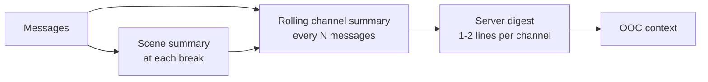

# Aettica — Design Doc

Sep 24, 2026 · @Neon

## Concept

Aettica gives you an AI **RP partner**, not a character: a writer with their own style who authors and plays multiple characters of their own.

- You create your partner, or roll one with RNG.
- The app is laid out like a Discord/Stoat server: channels you both create and rearrange.
- A shared lorebook/notebook (Obsidian-style links, Xoul-style fields, per-entry system prompts) holds characters and lore, and can be pinned to channels.
- OOC channels are for talking to your partner directly, including just hanging out, like a friend outside the RPs.
- In OOC, the partner sees a compressed digest of every channel, so they understand the whole server.

## Core architecture

A small Bun server runs in Termux on the phone and holds all data; you use Aettica in the browser, installed to the home screen as a PWA. No APK or Android SDK needed.

**The prompt stack**, assembled for every generation:

1. Partner identity and writing style (who is writing)
2. How to write in this channel: the mode instructions (literary or casual), then the partner's own prompt for this kind of channel (literary, casual or OOC)
3. The channel's cast and lore: its pinned notebook entries, entries they link to, notes attached to recent messages, open comment threads, and what's waiting for the partner
4. Connection profile's model-quirk prompt
5. Scene summaries and recent messages

**The partner prompt is split in four:** who the partner is (layer 1, every channel), and how they write in literary scenes, casual scenes and OOC (layer 2, only in that kind of channel). One combined prompt made the model mix them up, e.g. writing paragraphs in OOC despite being asked for a sentence or two, because the literary instructions were in the same prompt.

**The core rule:** a partner turn never requires a user message. The code has one "partner takes a turn" function that anything can call: your message, an event, or (later) a timer. This keeps proactivity an add-on instead of a rewrite.

**Every turn can be stopped.** A Stop button ends a turn in progress, and nothing from it is saved. Only one turn runs per channel at a time, but different channels can run at once.

Hidden-item privacy is a matter of trust, not security: the data lives on your phone and could be inspected.

## Channels and scenes

A channel is a storyline; scene breaks divide it into scenes without needing a new channel.

- **Scene breaks** are real objects in the data, stored in order with the messages and shown as a divider with an optional scene title. Typing `=====` alone as a message creates one (`===== The Storm` gives it a title), as does the new-scene button; the partner can create them with a tool.
- **A channel ending on a scene break** asks the partner to open the new scene on their next turn.
- **Each break triggers a scene summary.** Later scenes get earlier summaries plus fresh messages, not the full raw history.
- **The cast is whoever's notebook entry is pinned.** Pinning adds a character to the channel; unpinning removes them. Pins carry across scene breaks.
- **Every message records** its author (you or partner), the character(s) it voices (or none, for narration/OOC asides), which connection profile generated it, and the mode it was written in.
- **Messages written together form a turn:** all the bubbles of one casual reply, or several lines you send at once. Regenerating replaces the partner's whole last turn.
- **OOC channels** are for talking to the partner as themselves.

### Channel modes

Each RP channel has a mode. A mode change takes effect at the next scene break, so scenes never mix styles. If the current scene has no posts yet, the change applies right away. Every message keeps the mode it was written in, so older scenes still look the way they were written.

|  | Literary | Casual |
| --- | --- | --- |
| Partner writes | One prose post, may cover several characters | Short in-character messages, one character per bubble |
| Display | Wide prose blocks | Tupperbox-style bubbles with character name and avatar |
| Turn length | Room to breathe, ends where you can respond | Snappy |
| You post as | Just your post | A character, via proxy prefix (`k: *waves*`) or picker |

- **Casual replies are split into bubbles** from `Name: text` lines, which the partner is asked to write. Only known names start a bubble, so text like `Note: ...` stays as text, and a reply with no names becomes one bubble.
- **Your characters** are notebook entries you own or share, each with an optional proxy prefix. Any of them can be used in any casual channel, and posting as one pins them to that channel's cast. Several tagged lines in one message become several bubbles.
- **A literary post voices the characters it mentions** by full or first name. If it names none and the partner has one character in the cast, it's theirs; otherwise it's narration.
- **In a casual scene, the prompt names your characters** so the partner doesn't write their lines.

Channel deletion is never direct for the partner: it needs your approval.

### Message comments

Both you and your partner can highlight part of any message and leave a note on it, like comments in Docs or Word.

- **A comment is stored as** the message, the highlighted character range, the author, and the note. It shows as a highlight with a small note marker, in both literary and casual modes.
- **Comments form threads.** Either of you can reply, and either can resolve a thread.
- **Comments are out of character.** They reach the partner as OOC notes, never as something the characters know.
- **The partner comments through a tool** during any turn: reacting to a line you wrote, flagging a continuity slip, or annotating their own post.
- **Your comment on a partner message is an event trigger,** so the partner can reply in the thread. A comment-triggered turn never posts into the RP channel: anything longer than a thread reply goes to an OOC channel as a message.
- Unresolved threads can feed into the server digest, so OOC remembers what's still open.

## Notebook and permissions

Every entry and folder has an owner, and only the owner changes its settings.

| Setting | Options |
| --- | --- |
| Owner | You, partner, or joint (shared lore) |
| Visibility | Visible, or hidden from the other person |
| Editing | Open, suggest-only, or locked |

- **Folders pass settings down** to their entries unless an entry overrides them.
- **Shared lore is always suggest-only.** Changes appear as a before/after comparison the other person approves or rejects. Most lore discussion happens in OOC first.
- Entries use Xoul-style fields and an optional per-entry system prompt, and link to each other Obsidian-style (`[[Character]]`).

**Decided in stage 4:**

- **Fields are flexible labelled pairs.** A new character starts from a template (Pronouns, Age, Appearance, Personality, Background, Speech) and new lore from Summary and Details, but any field can be renamed, added or removed. Stage 1 to 3.5 character sheets were read into fields line by line (`Label: value`).
- **Characters are played by their owner:** yours by you, your partner's by your partner, and shared ones by either of you. You can give a shared character a proxy prefix; it's yours to set without a suggestion, since it only affects your own posts.
- **Links pull in one step.** Entries linked with `[[Name]]` (or `[[Name|shown text]]`) from a pinned entry join the prompt as "linked notes", but links from those don't, so the prompt stays small.
- **You can make entries for your partner** (until stage 6 gives them their own tools), including handing over one of yours. Once given away, only the new owner can change its settings. Only the owner picks an entry's visibility and editing, even when making it.
- **Deleting:** each of you deletes your own entries directly. Deleting the other person's entries, or shared lore, is a suggestion for the other one to approve. (Changed in stage 6: at first your partner couldn't delete anything.)
- **Suggestions wait.** Suggestions are stored with who made them. Your partner reviews yours from stage 6; until then they wait, and you can withdraw them.
- **Unpinning always works,** even for an entry hidden from you: it's your story, and you can see that something is pinned.
- **Folders are one level deep** and belong to whoever made them. Deleting a folder keeps its entries.

### Hidden items

- **Partner hides from you:** hidden in your view, but the partner still writes with it. A pinned hidden character shows as "??? (hidden)" in the cast. Hidden details are kept out of anything you see, including summaries, and the partner is told to keep the secret in OOC.
- **You hide from partner:** the entry never enters their context, so it's a true surprise, but they can't set it up.
- **Reveal** is an owner action that makes a hidden item visible.

## Partner autonomy

The partner acts through tools, and "do nothing" is always an option and usually the right one.

**Tools:** create channel, rename, reorder, read/search/create/edit notebook entries (per permissions), delete their own entries, hide or reveal their own entries, review your suggestions, pin/unpin, create scene break, propose channel deletion, comment on a message (and reply to or resolve threads), do nothing.

Your partner never deletes a channel, or anything of yours, directly: that's a proposal or suggestion, shown to you as an approve/deny card in the inbox.

**Decided in stage 6:**

- **A turn is a tool loop.** The model can call tools, see the results and call more, up to six rounds; the last round offers no tools, so it has to write. Actions take effect as they happen. `do_nothing` ends the turn without a post.
- **Tools are only offered on tool-capable profiles**, with short rules in the prompt: use them only when they help, read an entry rather than guess, never mention tools in the writing.
- **Messy tool calls are handled, not failed.** Broken JSON arguments are repaired or explained back to the model; tool calls written as text (Qwen/GLM, Kimi and DeepSeek formats) are found and run. Every call is logged with its arguments as written, its result and its source, and the app has a per-channel tool log and a per-profile "Test tools" button, since tool support varies so much between models.
- **Your partner reviews your suggestions on their next turn with tools,** and can accept or reject them.
- **Attaching notes:** a paperclip in the composer, or `[[Name]]` in a message, attaches notebook entries to it. They're sent in full while the message is in the conversation, so your partner has the details when you're talking about a character. They can also read any entry they can see with a tool.
- **Comment replies** use the same turn with a different ending: your comment, and a request for a short out-of-character reply that goes into the thread. Your partner replies when it's their message or they're already in the thread.
- **Actions are shown under the message** that turn wrote ("⚙ Arlo read Ilse Marrow, pinned Tamsin"), or on their own if the turn wrote nothing, and your partner's prompt lists their recent actions and how their proposals went.

**Version one uses event triggers.** The partner gets a turn when:

- you open the app
- a scene ends
- a lore change is waiting for their review
- you've been away a while

A wake-up gives the partner the server digest, pending items, and time since you last talked. The heartbeat is an endgame feature (see below).

## Models, profiles and roulettes

All models run through nanoGPT; connection profiles lock each model's settings, and roulettes mix profiles for variety.

**A connection profile holds:** model, samplers, reasoning settings, a model-quirk prompt, and a "supports tools" flag.

The quirk prompt tames the *model* ("stop restating the scene"), never defines the partner's personality. Swapping models changes execution, not who's writing.

**A roulette** is a weighted set of profiles (e.g. 40% DeepSeek 3.1 Terminus, 30% GLM 5.2, 30% Kimi); one is picked per turn. A regenerate can reroll the roulette or pin a specific profile.

**Jobs get their own assignments**, globally with per-channel overrides:

| Job | Assigned to | Tools needed |
| --- | --- | --- |
| RP writing | Profile or roulette | Only for agentic actions |
| OOC chat | Profile or roulette | Yes |
| Summaries and digest | A cheap, steady profile | No |
| Wake-ups and idea grading | Profile or roulette | Yes |

Agentic jobs only draw from tool-capable profiles. If a writing turn lands on a profile without tools, it writes but can't act.

Current models: DeepSeek 3.1 Terminus and 4 Pro 0813, GLM 4.5 Air and 5.2, MiMo 2.6, Kimi K2.5/6, MiniMax M3, Gemini 3.7 Flash.

**Decided in stage 5:**

- **A profile holds** model, temperature, max tokens, top-p, reasoning effort, a "can use tools" flag, model notes (layer 4), and extra request fields (JSON) for anything else. Settings that aren't set are left out of the request.
- **Two jobs for now:** roleplay writing and OOC chat, each assigned a profile or roulette server-wide, with per-channel overrides. Summaries and wake-ups get theirs in stages 7 and 8.
- **Regenerate rerolls; "Regenerate with…" pins a profile.** Each partner message records the profile that wrote it.
- **The old model settings became the first profile,** and the last profile can't be deleted. Deleting one in use puts its jobs and channels back to the default.

## Summaries and the server digest

Summaries are layered so context stays small without losing the thread.

- **Scene summaries** are written at each scene break and stored.
- **Rolling channel summaries** are updated incrementally, not regenerated from scratch.
- **The server digest** gives each channel one or two lines: who's in it, where the story stands, the emotional temperature. OOC gets the digest, and can pull a fuller channel summary when that channel comes up.
- Hidden-from-you details never appear in summaries you can see.

## Themes

The whole look of Aettica is themeable, including glassy, skeuomorphic styles like Frutiger Aero, Aero Glass and liquid glass. You can make your own themes, and each channel can have its own.

- **A theme is a folder** in `data/themes/`: a CSS file plus optional images (wallpapers, textures, glossy button art). A simple theme changes a few variables; an elaborate one can restyle anything. Built-in themes live in the project's `themes/` folder and can be copied but not changed.
- **Themes are made in the app**: copy a theme, edit its CSS, add images and fonts, and press Apply to see the result. No file editing on the phone needed.
- **Themes layer.** The app theme applies everywhere. A channel theme overrides it inside that channel only: its messages, header, composer and background. The sidebar and settings keep the app theme, so switching channels never changes the whole app.
- **Channel themes are scoped.** Aettica wraps a channel theme's CSS so it only reaches that channel's view and can't break the rest of the app.
- **A channel theme fully replaces the app theme inside its channel.** Its tokens start from the defaults rather than the app theme's, and the app theme is scoped to stop at the channel, so a channel looks the same whatever the app theme is.
- **Built-in themes** ship with the app as starting points to copy and edit: Classic (the default dark look), Frutiger Aero, Aero Glass, Liquid Glass, and Rainy Window (a blurred night city behind raindrops on glass, the two layers drifting at different speeds as you scroll, with liquid glass message bubbles).
- **Themes can offer sliders.** A theme declares options in its theme.json (a label, a range, and the CSS variable each sets), and Appearance shows them for the app theme and the open channel's theme. The values are saved server-wide, per theme. Rainy Window uses them for bubble transparency and blur, raindrop strength and parallax.
- **Glass has a cheap fallback.** Real backdrop blur is demanding on phones. A theme can provide a Lite version (no blur, more solid panels), used when you choose it or when the real one stutters. Glass effects are set per device: Automatic (Full, switching to Lite if scrolling stutters), Full, or Lite.

**Theme-ready from stage 2.** Until the theme stage, the app is built so themes will be easy to add:

- Every visual value (colours, blur, borders, shadows, radius, fonts, backgrounds) goes through a named CSS variable.
- Elements have descriptive class names a theme can target (`.sidebar`, `.message-bubble`, `.channel-header`).
- Panels and bubbles have spare layers for glass effects: a backdrop, a highlight, and a glow.

## Build stages

Each stage adds one new concept, so there's only ever one new thing to learn. Stage 1 is essentially Tiny RP.

**Progress:** stages 1 to 6 are built. See [docs/stage-1.md](docs/stage-1.md), [docs/stage-2.md](docs/stage-2.md), [docs/stage-3.md](docs/stage-3.md), [docs/stage-3.5.md](docs/stage-3.5.md), [docs/stage-4.md](docs/stage-4.md), [docs/stage-5.md](docs/stage-5.md) and [docs/stage-6.md](docs/stage-6.md) for how they work.

| Stage | Adds | New concept learned |
| --- | --- | --- |
| 1 | One chat with a partner prompt and one character sheet, via nanoGPT | Server, API calls, prompt assembly |
| 2 | Multiple channels, OOC channel, message authorship | Database, data relationships |
| 3 | Scene breaks and literary/casual modes | Per-channel settings, rendering modes |
| 3.5 | Themes: app theme, per-channel themes, built-in glass themes | Theme files, CSS variables, scoping |
| 4 | Notebook with pinning and permissions | Ownership, access rules |
| 5 | Connection profiles and roulettes | Configuration, weighted picks |
| 6 | Tools, the approval queue, and message comments | Tool calling, proposals |
| 7 | Scene summaries and server digest | Summarization pipelines |
| 8 | Event-triggered partner turns | Events, partner turn without a message |

## Endgame features

These are parked until the core works.

- **Heartbeat:** a timer wakes the partner even with the app closed, so they can text you out of nowhere. Needs Termux wake lock and Termux notifications.
- **Generate-and-grade:** on a heartbeat, the partner generates an idea (new RP, character, twist), reviews it, and only sends it if still excited about it.
- **Idea drawer:** ideas that fail review are kept privately and can resurface when they fit better.
- **Controls:** chattiness setting, quiet hours, and cooldowns to limit spam and API cost.
- **RNG partner creation.**
- **Channel categories** and drag-and-drop reordering polish.
- **Multi-bubble OOC** with typing delays, reusing the Kitsikai extension ideas.

## Open questions

- [x] How does the partner review your shared-lore proposals: immediately, or on their next wake-up? Can they reject? On their next turn with tools, in any channel; they can accept or reject. (Stage 8's wake-ups will add a turn for it.)
- [ ] Does the partner keep private notes about you and your friendship for OOC memory?
- [x] Which Xoul-style fields does a notebook entry have? Flexible labelled fields, starting from a template per kind (see "Decided in stage 4").
- [ ] Which of your nanoGPT models reliably handle tool calling? Each profile's "Test tools" button, and the tool log, will answer this.
- [ ] How often do rolling channel summaries update (every N messages)?
- [ ] Is there ever more than one partner per server?
- [ ] Should a channel theme also restyle the sidebar while you're in that channel?
- [ ] Can the partner pick or suggest a channel's theme (for example when creating a channel)?
- [x] Should your casual characters stay server-wide, or become notebook entries pinned to each channel's cast in stage 4? They're notebook entries, usable anywhere, and posting as one pins it to the channel.
- [ ] Do your models reliably write the casual `Name: text` format?
