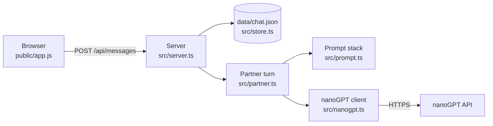

# Stage 1: how it works

> This describes Aettica as it was at the end of stage 1. Stage 2 replaced `data/chat.json` with a database and moved the API routes under `/api/channels/:id/`; see [stage-2.md](stage-2.md) for what changed.

Stage 1 is the smallest complete Aettica: one chat, one partner, one character sheet, one model. According to [DESIGN.md](../DESIGN.md), its three new concepts are **a server**, **API calls** and **prompt assembly**. This document walks through each, pointing to the code where it happens.

## The big picture



Three programs are involved:

1. **The browser** shows the chat and sends your actions to the server. It never talks to nanoGPT and never sees your API key.
2. **The server**, run by Bun in Termux, holds all the data and decides what happens.
3. **nanoGPT**, on the internet, runs the language model.

## Concept 1: the server

A web server waits for **requests** and sends back **responses**. Each request has a *method* (GET to read, POST to create, PUT/PATCH to change, DELETE to remove) and a *path* such as `/api/state`.

`src/server.ts` does two things with incoming requests:

- **Paths starting with `/api/`** go to the `route` function, which works out which action you asked for and returns JSON. The full list of routes is at the top of that file.
- **Every other path** is a file from `public/`, like `/app.js` or `/style.css`. `/` serves `index.html`.

Some details worth knowing:

- **The server only listens on `127.0.0.1`** by default, meaning "this device". Anything else on your Wi-Fi can't connect.
- **Requests that change data must be JSON** (`checkRequestIsFromTheApp`). This stops other websites you visit from quietly making your partner take turns, because browsers won't send cross-site JSON without the server's permission.
- **Errors become JSON too**, like `{ "error": "..." }` with a matching status code (400 for a bad request, 409 for "partner is busy", 502 for "the model failed"). The browser shows the message as it is.
- **`createApp` builds the handler without starting the server.** `main()` starts it. This split lets the tests send requests to the handler directly.

### Where data lives

`src/store.ts` keeps the chat in memory and rewrites `data/chat.json` after every change. It writes to a temporary file first, then renames it over the real one, so a crash mid-save can't leave a half-written file. If the file is ever corrupt, the server refuses to start rather than overwrite your chat.

The rest of the server only uses the store's methods (`addMessage`, `getSettings`, ...), never the file itself. In stage 2 a real database replaces the JSON file, and only `store.ts` should need to change.

## Concept 2: API calls

`src/nanogpt.ts` talks to nanoGPT. nanoGPT uses the same "chat completions" format as OpenAI, so one request looks like this:

```http
POST https://nano-gpt.com/api/v1/chat/completions
Authorization: Bearer <your key>
Content-Type: application/json

{
  "model": "deepseek-ai/DeepSeek-V3.1-Terminus",
  "messages": [
    { "role": "system", "content": "## Who you are ..." },
    { "role": "user", "content": "*I knock on the door.*" }
  ],
  "temperature": 0.9,
  "max_tokens": 1024
}
```

The reply is JSON, with the generated text at `choices[0].message.content`.

Things that can go wrong, and how they're handled:

| Problem | What you see |
| --- | --- |
| No API key set | A message telling you to set `NANOGPT_API_KEY` |
| Wrong key (HTTP 401), no balance (402), unknown model (404), rate limit (429) | A plain-language explanation plus nanoGPT's own message |
| No network, or no reply within the timeout | "Couldn't reach nanoGPT" or "took longer than N seconds" |
| Empty reply | "The model returned an empty reply", or a hint to raise Max tokens if it was cut off |

Some reasoning models put their private thinking inside `<think>...</think>` at the start of the reply. `stripReasoning` removes it so only the post is saved.

Replies arrive all at once rather than word by word. Streaming (showing the reply as it's written) would be a good later improvement, but it makes both server and browser more complicated.

## Concept 3: prompt assembly

A model remembers nothing between requests. Each turn, `src/prompt.ts` rebuilds everything the partner needs to know. This is the **prompt stack** from the design doc:

| Layer | Contents | Stage 1 |
| --- | --- | --- |
| 1. Who is writing | Fixed framing ("you are a writer, not the character") + your partner prompt | ✅ |
| 2. Channel mode | Literary or casual instructions | Empty slot (stage 3) |
| 3. Characters | The character sheet | ✅ (stage 4 uses pinned notebook entries instead) |
| 4. Model quirks | The connection profile's quirk prompt | Empty slot (stage 5) |
| 5. What happened | Recent messages | ✅ (stage 7 puts scene summaries first) |

Layers 1 to 4 become one `system` message, each under a `## Heading`. Empty layers are left out. Layer 5 follows as alternating `user` (you) and `assistant` (partner) messages.

Three details:

- **Only recent messages are sent.** The *History* setting (default 40) decides how many. Older ones are left out until stage 7 adds summaries.
- **Two posts in a row from the same author are merged** into one message, because some models reject two `user` messages in a row.
- **If the chat doesn't end on your message**, a short out-of-character nudge is added at the end: *"No new post from me this time. Take your next turn..."* (or an "opening post" nudge when the chat is empty). Models expect to be answering something, and this is how the partner can take a turn without you writing anything. The nudge is never saved or shown in the chat.

Use **Settings → Preview prompt** to see the exact stack for the next turn.

## The core rule: one partner turn

The design says *a partner turn never requires a user message*. In code, that's `Partner.takeTurn` in `src/partner.ts`, the only place the partner ever writes. It doesn't take your message as input. It reads what's already saved, builds the prompt stack, asks the model, and saves the reply.

Everything that makes the partner write goes through it:

| Action | Route | What happens first |
| --- | --- | --- |
| You send a message | `POST /api/messages` | Your message is saved, then `takeTurn("user-message")` |
| You press **Partner's turn** | `POST /api/turn` | Nothing, just `takeTurn("continue")` |
| You press **Regenerate** | `POST /api/regenerate` | `takeTurn("regenerate", { replacing })` leaves the old reply out of the prompt, then swaps it for the new one only if generation succeeds |

In stage 8, events like "you opened the app" call the same function. Nothing about it has to change.

`takeTurn` also allows only **one turn at a time**. A second request while the partner is writing gets a "partner is busy" error instead of starting a duplicate reply.

### When a reply fails

- **After sending a message:** your message stays saved. The app shows the error with **Try again**, which asks for a partner turn. That turn answers the message you already sent.
- **On Partner's turn or Regenerate:** nothing is saved or deleted, so the chat looks exactly as it did before.

## The web app

`public/` is plain HTML, CSS and JavaScript with no framework and no build step, so you can read it directly.

- **`index.html`**: the page layout, with the settings and prompt preview dialogs.
- **`app.js`**: keeps a copy of the chat in `state`, calls the server with `api()`, and redraws the message list with `render()`. Text from messages is always escaped before display, so a reply containing HTML can't run code. `*italics*` and `**bold**` are the only formatting.
- **`style.css`**: a Discord-style dark theme. All colours are variables at the top.
- **`manifest.webmanifest`, `sw.js`, `icon.svg`**: make the site installable as an app. The service worker deliberately caches nothing. The server is on the same phone, so there's nothing slow to hide, and caching could show you an out-of-date chat.

## Tests

`bun test` runs three test files:

- **`test/prompt.test.ts`**: layer order, empty layers, merging, nudges, history limit.
- **`test/store.test.ts`**: saving and reloading, editing, corrupt-file protection, settings validation.
- **`test/server.test.ts`**: end-to-end behaviour through the real request handler.

The server tests run against a **fake nanoGPT** (`startFakeNanoGpt` in `test/helpers.ts`), a tiny local server that returns scripted replies and errors. Every real code path runs, including the HTTP call, without an API key, network access or cost.

## What stage 2 changes

Stage 2 adds multiple channels, an OOC channel and proper message authorship (which character a message voices). That means:

- `store.ts` moves from a JSON file to a database (Bun has SQLite built in), with channels and messages as separate tables.
- `Message` gains a channel id and the character(s) it voices.
- `takeTurn` takes the channel to write in.
- The app gets a channel sidebar.
