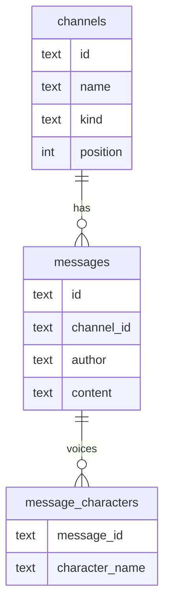

# Stage 2: how it works

> This describes Aettica as it was at the end of stage 2. Stage 3 added scene breaks and modes, and changed some API responses to lists (`userMessages`, `partnerMessages`); see [stage-3.md](stage-3.md).

Stage 2 turns one chat into a server of channels. According to [DESIGN.md](../DESIGN.md), it adds **multiple channels, an OOC channel and message authorship**, and its new concepts are **a database** and **data relationships**.

This document covers what changed since [stage 1](stage-1.md). Everything that document says about the server, API calls and the single partner turn still holds.

## What you can do now

- Create **roleplay** and **out-of-character** channels with the **+** at the top of the channel list.
- Give each roleplay channel its own **character name** and **character sheet** (channel settings, the gear at the top right).
- Rename, reorder (↑ ↓ in channel settings) and delete channels.
- Talk to your partner **as themselves** in OOC channels. They know which storylines exist on the server.
- See who wrote each message: partner posts in a roleplay channel show the character's name with your partner's name as a small badge.
- Keep separate drafts per channel, and have your partner write in two channels at once.
- On a phone, the channel list is a drawer behind the ☰ button.

## Concept 1: the database

Stage 1 kept everything in one JSON file and rewrote it after every change. That's fine for one chat, but with many channels it would mean rewriting every message in every channel whenever anything changed. Stage 2 uses **SQLite**, a database that is still a single file (`data/aettica.db`) but can find, add and change individual rows without touching the rest. It's built into Bun, so there's nothing extra to install.

A database stores data in **tables**. Each table has fixed **columns**, and each item is a **row**. Aettica's tables are created in `src/db.ts`:

| Table | One row per | Main columns |
| --- | --- | --- |
| `settings` | setting | `key`, `value` (as JSON) |
| `channels` | channel | `id`, `name`, `kind` (`rp` or `ooc`), `position`, `character_name`, `character_sheet` |
| `messages` | message | `seq`, `id`, `channel_id`, `author`, `content`, `created_at`, `edited_at`, `model` |
| `message_characters` | character voiced by a message | `message_id`, `character_name`, `position` |

All the SQL that reads and writes these tables lives in `src/store.ts`. Nothing else in the server writes SQL, so when the layout changes, that's the only file with queries to update.

### Migrations

The layout of the tables will change in later stages: scene breaks, notebook entries and so on. A **migration** is one step that changes the layout. `src/db.ts` keeps a list of them, and SQLite stores a version number inside the database file (`PRAGMA user_version`). On startup, any steps the file hasn't had yet run in order. An old database is upgraded automatically; a new one is built by running every step.

Two rules keep this safe:

- **Each step runs in a transaction**, so it happens completely or not at all. A crash mid-upgrade can't leave a half-changed database.
- **Released steps are never edited.** A database that already ran step 1 won't run it again, so changes always go in a new step at the end.

If you ever open a database with an *older* Aettica than the one that created it, the server refuses to start rather than guess.

### Your stage 1 chat

The first time stage 2 starts, `src/legacy.ts` looks for the stage 1 file `data/chat.json`. If it's there:

- your settings become the server settings
- your chat becomes the `#story` channel, with your character sheet (the character name is taken from a `Name:` line in the sheet, if there is one)
- an empty `#ooc` channel is added
- the old file is renamed to `chat.json.imported`, not deleted, so you can check everything came across before removing it

Without a stage 1 file, a new server starts with `#story` (the example character, Ilse) and `#ooc`.

### Backing up

While the server is running, SQLite keeps recent changes in two extra files next to the database: `aettica.db-wal` and `aettica.db-shm`. To back up, either stop the server and copy `aettica.db`, or copy all three files together.

## Concept 2: data relationships

Tables point at each other through ids:

Read it as "a channel has many messages, and a message voices any number of characters". Each message row stores the id of its channel (`channel_id`). This is a **one-to-many** relationship.

The database enforces these links itself:

- **`REFERENCES`** means a message can only point at a channel that exists. Trying to save a message into a missing channel is refused by SQLite.
- **`ON DELETE CASCADE`** means deleting a channel deletes its messages, and deleting a message deletes its character rows. Nothing is left behind pointing at something that's gone.
- **`CHECK`** limits a column to certain values, so `kind` can only ever be `rp` or `ooc`.

### Why characters get their own table

A message can voice no characters (narration, OOC chat, your own posts for now), one, or several. A single `character` column could only hold one. So each voiced character is a row in `message_characters`, and a message's characters are "all the rows with its id". When `store.ts` reads messages, a small inner query gathers those rows into a list, so each message arrives with a `characters` array.

In stage 2 the partner always voices the channel's one character. The table is ready for stage 3 (you posting as a character in casual mode) and stage 4 (characters coming from notebook entries).

## RP and OOC prompts

The prompt stack keeps its five layers, but layers 1 and 3 now depend on the channel. See `src/prompt.ts`.

| Layer | Roleplay channel | OOC channel |
| --- | --- | --- |
| 1. Who is writing | "You're the author behind a character" + partner prompt | "You're yourself, talking to a friend" + partner prompt |
| 3. Characters | This channel's character sheet | A list of the server's channels and who your partner plays in each |
| 5. Messages | This channel's messages only | This channel's messages only |

The OOC channel list is the first small piece of the **server digest** from the design doc. [Stage 7](stage-7.md) adds a short summary of each channel to it.

The "no new message" nudges also differ: in a roleplay channel your partner is asked to move the story forward; in OOC, to say what's on their mind.

## The partner turn, per channel

`Partner.takeTurn` now takes the channel to write in. Everything else about it is unchanged: it reads what's saved, builds the prompt, asks the model, saves the reply, and never needs your message.

The "one turn at a time" rule is now **one turn per channel**. Your partner can be writing in `#story` and `#ooc` at the same time, but not twice in the same channel. While a turn runs in a channel, you can't delete that channel or its messages, because the reply would have nowhere to go.

Each saved partner message records the character it voices: the channel's character name in roleplay, nobody in OOC.

### Stopping a turn

While your partner is writing, a **Stop** button appears next to "Arlo is writing…". It calls `POST /api/channels/:id/cancel`, which runs `Partner.cancel`:

- Each running turn holds an `AbortController`, a standard JavaScript object for stopping work early. `cancel` fires it, which abandons the request to nanoGPT (`src/nanogpt.ts` passes its signal to `fetch`).
- The channel is freed at once, and nothing is saved. If you'd just sent a message, that message stays; if you were regenerating, the old reply stays.
- The request that started the turn gets `{ "cancelled": true }` back instead of a reply.

Separately, every request to nanoGPT has a time limit (`REQUEST_TIMEOUT_SECONDS`, 3 minutes by default). It applies both while waiting for the reply to start *and* while it's arriving, so a model that stalls halfway also gives up cleanly.

### Lost requests

On a phone, a request can be lost without ever failing: when the app goes to the background or the screen locks, the connection can quietly drop, and the page would wait forever for an answer that's never coming.

So while any channel shows "writing…", the page asks the server every 3 seconds which channels are really busy (`checkBusy` in `public/app.js`):

- If the server has finished with a channel but the page never heard back, the page stops waiting and reloads the channel, so the reply appears.
- If the page's message never reached the server at all, the text goes back into your message box instead of being lost.
- A request younger than 8 seconds is never treated as lost, since it may simply not have arrived yet.

The same check picks up turns started somewhere else, such as another tab or before a reload.

### Updates while the app is open

An installed app can stay open in the background for days. After you update Aettica and restart the server, a page that's still open would keep running the old code. So `/api/state` includes `appVersion`, a fingerprint of the files in `public/` (`appVersion` in `src/server.ts`). The page remembers the fingerprint it started with, and compares it whenever it hears from the server and whenever you switch back to the app:

- If they differ and you have nothing unsaved, the page reloads itself.
- If you have unsent text, an open dialog, or a reply being written, a banner offers a **Reload** button instead, so nothing is lost.

## The API

Routes are now a table in `src/server.ts`, each with a method, a path pattern like `/api/channels/:id/turn`, and a handler. `matchRoute` compares a request against a pattern and pulls out the `:id`. The full list is at the top of that file. Most stage 1 routes moved under `/api/channels/:id/...`.

Errors are sorted more carefully than in stage 1:

| Error | Status |
| --- | --- |
| Invalid input (`ValidationError`) | 400 |
| Unknown channel or message (`NotFoundError`) | 404 |
| Partner already writing in that channel (`BusyError`) | 409 |
| A turn you stopped (`CancelledError`) | 200, with `{ "cancelled": true }` (not an error) |
| The model failed (`ApiError`) | 502 |
| Anything else: a bug | 500, with details in the server log |

## The web app

- **Sidebar**: the channel list, with a pulsing dot on channels where your partner is writing. At the bottom, your partner's name and the server settings.
- **Channel view**: header, messages and composer for the open channel. The channel's id is in the address bar (`#/channel/<id>`), so reloading keeps your place.
- **Dialogs**: server settings, channel settings, new channel, and prompt preview.

If you switch channels while your partner is writing, the reply is saved as usual and appears when you come back. If a turn is running from somewhere else (another tab, or before a reload), the app checks back every few seconds until it's done.

### Theme-ready

The stylesheet was rebuilt for the theme stage (3.5):

- Every colour, border, shadow, blur, radius and font is a named variable in the `:root` block of `public/style.css`. The rules below it only use those variables.
- Elements have descriptive class names (`.sidebar`, `.channel-header`, `.message-author`, ...).
- Panels a glass theme would blur (`.surface`) never use `::before` or `::after`, leaving those free for highlights and glows.
- The channel view carries `data-channel-id` and `data-channel-kind`, which per-channel themes will use.

[theme-reference.md](theme-reference.md) lists every variable and class.

## Tests

`bun test` now runs four files:

- **`test/store.test.ts`**: starting content, migrations, channels, messages and their characters, cascading deletes, validation.
- **`test/legacy.test.ts`**: importing a stage 1 chat.
- **`test/prompt.test.ts`**: the RP and OOC prompt stacks.
- **`test/server.test.ts`**: every route end to end against the fake nanoGPT, including per-channel busy rules and routing.

## What stage 3 changes

Stage 3 adds **scene breaks** and **literary/casual modes**:

- A new migration adds scene breaks as rows, and a mode setting on RP channels.
- Layer 2 of the prompt stack (mode instructions) gets filled in.
- Casual mode lets you post as a character, which is where `message_characters` gets used for your messages too.
- The message list learns a second display style (bubbles).
