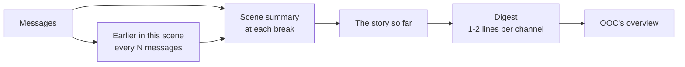

# Stage 7: how summaries and the server digest work

Stage 7 lets stories grow as long as you like without your partner forgetting how they began. According to [DESIGN.md](../DESIGN.md), its new concept is **summarization pipelines**: messages are condensed step by step into scene summaries, the story so far, and a line or two per channel, and each step feeds the next.

## What you can do now

- **Write as long as you like.** Your partner always reads a channel's newest messages in full (Settings → Memory → Recent messages, 40 by default) and remembers everything older through summaries.
- **Read each scene's summary**: press **Summary** under a scene break to see what happened in the scene that ended there. **Edit** it to put it in your own words, or **Rewrite** it.
- **See a channel's memory** in channel settings → **Memory**: the story so far (which you can edit), what happened earlier in the current scene, and the channel's one-line digest. **Update now** writes whatever is due straight away; **Rebuild all** rewrites every summary from the messages.
- **Talk about your stories in OOC.** Your partner sees every channel's digest ("#story: roleplay, you play Ilse Marrow. At the lighthouse; tense, slowly warming."), and when a channel comes up in the conversation, its fuller summary.
- **Choose how it works** in Settings → Memory: turn summaries on or off, how often a long scene is condensed, and which profile or roulette writes them (a cheap, careful model is a good choice).

## Concept: a summarization pipeline

A model can only read so much at once, and reading costs money and time. So a prompt holds only the recent messages, and everything older is condensed. Condensing all of it again for every turn would be slow and expensive, so it happens in steps, each building on the last:



| Summary | Covers | Written when | From |
| --- | --- | --- | --- |
| **Scene summary** | One finished scene | Its scene break is added | The scene's messages (starting from "earlier in this scene", if it has one) |
| **The story so far** | Every finished scene | A scene summary is written | The story so far, plus the new scene summaries |
| **Earlier in this scene** | The older part of the scene still going (in OOC channels, of the whole conversation) | More than `historyLimit + summaryEvery` of its messages are waiting | What it said before, plus the oldest waiting messages |
| **Digest** | The whole channel, in one or two lines | The channel has moved on (8 new posts, or a new story so far) | The story so far, the last scene, earlier in this scene, and the newest messages |

Each step is **incremental**: the model is shown its notes so far and only what's new, and asked for the updated notes ("fold the new part into your notes so far"). A new scene adds one scene's worth of work, however long the story is. Anything too long for one request is read in chunks, each folded into the notes from the ones before (`chunkLines` and `summaryRequest` in `src/summaries.ts`).

### Nothing falls in between

Messages leave the prompt in batches, not one by one. While a scene's oldest messages wait to be summarized, they're still sent in full: a scene can show up to `historyLimit + summaryEvery` messages. Then the oldest are folded into "earlier in this scene", leaving the newest `historyLimit`. So every message is either in the prompt or in a summary, never neither (`windowStart` in `src/summaries.ts`).

If summaries fall behind (say the model writing them keeps failing), the prompt still stops at `historyLimit + 2 × summaryEvery` messages, so a turn never becomes enormous.

### What reaches the prompt

Summaries are layer 5 of the prompt stack, "what has happened", at the end of the system message, before the recent messages. Only what covers messages that aren't sent in full is included (`memoryFor` in `src/partner.ts`):

```
## The story so far

Kestrel, soaked, found Ilse's lighthouse in a storm. Ilse let her in grudgingly...

## Recent scenes

Scene 2, "The Lamp Room": Ilse showed Kestrel the lamp room...

## Earlier in this scene

Kestrel asked about the drowned bell. Ilse changed the subject...
```

The last two finished scenes are included in full, besides the story so far, because the story so far compresses older events more and more.

In an **OOC channel**, "Channels on your server" gets each channel's digest, and if a channel comes up in the last few messages (as `#story`, or its name as a word), an **About #story** section gives its story so far, last scene, and what's happened in the scene still going. With tools, your partner can also look up any channel with **`read_channel_summary`**.

### Nothing hidden from you, ever

Summaries are written only from the messages, which you can all read, never from the notebook, where secrets live. So an entry hidden from you can't leak into a summary you read. (Your partner still knows their secrets: the notebook is in their prompt as before, just not in the summaries.)

### When things change

Summaries follow the messages they cover (`Summaries.messageChanging` in `src/summaries.ts`):

- **Editing or deleting a message** in a finished scene marks that scene's summary and the story so far as out of date, and they're rewritten. In the current scene, "earlier in this scene" is rewritten if it covered the message.
- **Deleting a scene break** joins the two scenes around it: the first one's summary is dropped, and the joined scene's is rewritten.
- **Your own words** (an edited scene summary, or story so far) are never rewritten by the model, except with **Rebuild all**. New scenes are still folded into a story you edited.
- **Clearing a channel** clears its summaries.

### Running in the background

Summaries are written by the **summarizer** (`src/summarizer.ts`), a few seconds after a channel changes, so a reply and your next message don't each set it off. It never blocks your partner's turns: a turn uses whatever summaries exist at that moment (and whatever isn't summarized yet is sent in full). Only one catch-up runs per channel at a time, in order: finished scenes, the story so far, earlier in this scene, the digest.

If a request fails, the error is shown in Memory, and the summarizer tries again the next time the channel changes, or when you press **Update now**. On startup, it catches every channel up, in case the server stopped midway.

Summaries use the profile or roulette in **Summaries written by** (or roleplay's, by default), with its temperature capped at 0.7 and room for at least 1,024 tokens, since summaries want care more than flair.

## Where things are stored

Migration 7 in `src/db.ts` adds one table:

| Table | Holds |
| --- | --- |
| `summaries` | One row per summary: the channel, its kind (`scene`, `story`, `current` or `digest`), the scene break it belongs to (for a scene summary, the break that ended it; for "earlier in this scene", the break that started it), the text, the newest message it covers (`through_seq`), and whether it's out of date (`stale`) or yours (`edited`) |

Deleting a channel deletes its summaries.

## Settings

| Setting | Default | What it does |
| --- | --- | --- |
| `historyLimit` (Recent messages) | 40 | How many of a channel's newest messages are always sent in full |
| `summaries` | on | Whether summaries are written and used. Off: older messages are simply left out, as before stage 7 |
| `summaryEvery` | 20 | How many messages may pile up beyond the recent ones before they're folded into "earlier in this scene" |
| `summaryAssignment` | "" (roleplay's) | Which profile or roulette writes summaries |

## API

- `GET /api/channels/:id/messages` now also returns the channel's `summaries`: `{ scenes, story, current, digest, running, error }`, with `scenes` keyed by the id of the scene break that ended each scene.
- `GET /api/channels/:id/summaries`: the same, on its own.
- `PUT /api/channels/:id/summaries` with `kind` (`"story"` or `"scene"`), `sceneId` (for a scene) and `content`: your own words. Empty text removes them, and the model writes that summary again.
- `POST /api/channels/:id/summaries/update`: write what's due now, and wait for it.
- `POST /api/channels/:id/summaries/rebuild`: rewrite everything from the messages, your edits included.
- `POST /api/channels/:id/summaries/scenes/:sceneId/regenerate`: rewrite one scene's summary.

## Tests

- **`test/summaries.test.ts`** (new): splitting channels into scenes; which messages are sent in full, with and without summaries, never leaving a gap; transcripts and chunks; each kind of summary, written in order and only when due, from a fake model; the story folded forward, not rewritten; a scene's notes starting its summary; OOC conversations; edits and deletions rewriting what covered them; your own words kept until you rebuild; failures shown and retried; summaries off; their own profile; the background catch-up; summaries in RP and OOC prompts (digests, and a channel that comes up); `read_channel_summary`; and the API.
- A test checks that a secret hidden from you never reaches a summary request.

The app itself (scene summaries under breaks, editing and rewriting them, Memory in channel settings, and the new settings) was checked in a real browser against a scripted fake model, on a phone-sized and a desktop-sized screen.

## What's next

Stage 8 adds **event-triggered partner turns**: your partner taking a turn without a message from you, when something happens (like opening the app).
